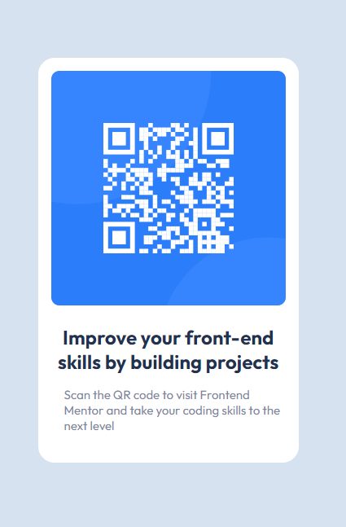

# Frontend Mentor - QR code component solution

This is a solution to the [QR code component challenge on Frontend Mentor](https://www.frontendmentor.io/challenges/qr-code-component-iux_sIO_H).

### Screenshot

### Links

- Solution URL: [Add solution URL here](https://your-solution-url.com)
- Live Site URL: [Add live site URL here](https://your-live-site-url.com)

## My process

### Built with

- Semantic HTML5 markup
- CSS custom properties
- Flexbox
- CSS Grid
- Mobile-first workflow

### What I learned

In developing this QR code component, I have gained valuable experience and knowledge in the following areas:

  1.Semantic HTML5 Markup: I learned the importance of using semantic HTML5 elements to structure the content properly. Semantic HTML not only improves accessibility but also enhances search engine optimization (SEO) and makes the code more understandable.

  2.CSS Custom Properties: I explored CSS custom properties (also known as CSS variables) to efficiently manage and reuse color schemes, fonts, and other design elements. Custom properties promote maintainability and consistency in the codebase.

  3.Flexbox: Through this project, I honed my skills in using Flexbox to create responsive layouts. Flexbox provided a straightforward way to align and distribute content within containers, ensuring a flexible and dynamic design.

  4.CSS Grid: I applied CSS Grid to enhance the alignment and positioning of elements in the QR code component. CSS Grid allowed me to create complex layouts with ease, making it a powerful tool for building grid-based designs.

  5.Mobile-First Workflow: Embracing a mobile-first workflow was a crucial part of this project. I prioritized designing and developing for smaller screens first and progressively enhanced the component for larger devices. This approach ensures a seamless user experience across various screen sizes.

These skills and principles not only contributed to the successful creation of the QR code component but also expanded my proficiency in web development and front-end design. I look forward to applying these learnings in future projects to create more accessible, responsive, and user-friendly web components.

## Author

- Frontend Mentor - [@yourusername](https://www.frontendmentor.io/profile/yourusername)
- Twitter - [@yourusername](https://www.twitter.com/yourusername)

**Note: Delete this note and add/remove/edit lines above based on what links you'd like to share.**

